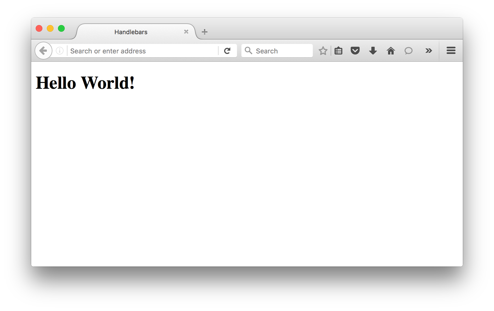

# Client-side Templates with Handlebars

We often want to generate HTML dynamically using values that can only be known at runtime as text or in attributes. If there is not too much HTML to generate, it is not too hard to do this in Javascript. If there is a lot of HTML, however, it becomes more difficult. It is hard to write this code because we are doing two things at once - writing HTML and writing Javascript. Such code is very often hard to read and update as well.

Templates are a solution to this problem. The idea is to write HTML as you would for static content but leave in it markers where dynamic data should be inserted. These snippets of HTML are then converted into functions to which you can pass data and from which you get back a string of HTML with the data you passed inserted in the right spots. The process of converting the templates into functions is usually referred to as _compilation_.

<a href="http://handlebarsjs.com">Handlebars</a> is a language for creating templates. It is based on another language called Mustache. Both Handlebars and Mustache use curly braces (which somewhat resemble <a href="https://www.google.com/search?q=handlebar+mustache&source=lnms&tbm=isch">handlebar mustaches</a>) to indicate the spots where data should be inserted.

Below is an example of a simple Handlebars template.

```html
<h1>Hello {{name}}!</h1>
```

## Including Handlebars in your HTML files

The Handlebars library is hosted by <a href="http://cdnjs.com">cdnjs</a> and you can include it in your HTML files with the following `<script>` tag:

```html
<script src="https://cdnjs.cloudflare.com/ajax/libs/handlebars.js/4.0.5/handlebars.min.js"></script>
```

You will want this tag to appear before any `<script>` that uses the `Handlebars` object that it creates.

## Including Templates in your HTML files

It is possible to keep your Handlebars templates in individual files and _precompile_ them into a js file containing a function for each template. For now we will include the templates in our HTML files and compile them when the page loads.

Stashing snippets of HTML in a page with the intent to eventually insert them into the DOM is such a common thing that there is now a `<template>` tag designed for this purpose. Unfortunately, it does not work well with Handlebars templates because it parses its contents as HTML. This means that we cannot have templates that place Handlebars code in places that are invalid locations for text in HTML (such as between a `<table>` and a `<tr>` tag). It also means the the `>` symbol, which is meaningful to Handlebars, will be escaped to `&gt;`.

To get around these problems with `<template>`, it is standard to use `<script>` tags for Handlebars templates. If we give the `<script>` tag a `type` attribute that the browser does not recognize, the browser will ignore the element altogether. HTML contained in it will not be parsed and will not be accessible via `document.getElementsByTagName`, `document.getElementsByClassName`, etc., which is precisely what we want.

```html
<script id="hello" type="text/x-handlebars-template">
    <h1>Hello {{name}}!</h1>
</script>
```

Our Javascript can find this and other `<script>` elements with this special `type` attribute in the page and compile their contents into functions.

```js
Handlebars.templates = Handlebars.templates || {};

var templates = document.querySelectorAll('script[type="text/x-handlebars-template"]');

Array.prototype.slice.call(templates).forEach(function(script) {
    Handlebars.templates[script.id] = Handlebars.compile(script.innerHTML);
});
```

Once you have a compiled template, you can call it with the data you want it to use and insert the result into your page.

```js
document.body.innerHTML = Handlebars.templates.hello({ name: 'World' });
```

After running the above command, the page looks like this:



## Writing Templates

When Handlebars templates are called they are given a _context_ in which to evaluate expressions. The context is the data that is passed to the template. Expressions within the template can set the context to be sub-parts of the data that was passed in.

```HTML
    {{name}}'s job title is {{#job}}{{title}}{{/job}} and she lives in {{location}}.
```

In the example above, the opening `{{#job}}` sets the context to be the `job` property of the object that is passed to the template. The closing `{{/job}}` sets the context back to the object that was passed in. The data passed to it might look like this:

```js
{
    name: 'Dana Scully',
    job: {
        title: 'Secret Agent'
    },
    location: 'Washington, DC'
}
```

If the context is a string, you can use `{{.}}` to print it out.

```HTML
    {{name}}'s job title is {{#job}}
        {{#title}}
            {{.}}
        {{/title}}
    {{/job}} and she lives in {{location}}.
```

You can also navigate down to the properties of sub-objects without nesting by using syntax similar to that used to navigate file systems:

```HTML
    {{name}}'s job title is {{job/title}} and she lives in {{location}}.
```

Similar syntax can be used to navigate _up_ to a higher object.

```HTML
    {{name}}'s job title is {{#job}}{{title}} and she lives in {{../location}}{{/job}}.
```

When the context is set to an array, Handlebars will automatically iterate over it.

```HTML
<ul class="authors">
{{#authors}}
    <li class="author">
        {{name}}
        <ul class="books">
            {{#books}}
                <li class="book">{{title}}
            {{/books}}
        </ul>
{{/authors}}
</ul>
```

In the example above, if the object that is passed to the template has no `authors` property, an empty string would be returned.

## Exercise

Create a page on which you transform <a href="authors.json">this JSON</a> into HTML using Handlebars. You can lay out the page any way you wish, but all of the data about each author should be shown. There is no need to make an ajax request to get this data. You can just cut and paste it into your code and store it in a variable.

## Bonus Exercise

Modify your <a href="wk3_spotify_search">Spotify project</a> to use Handlebars to generate the HTML for your search results.
